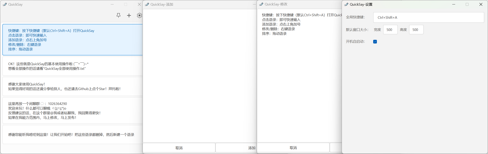
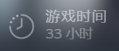
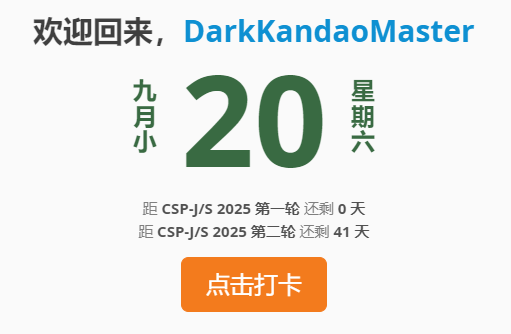
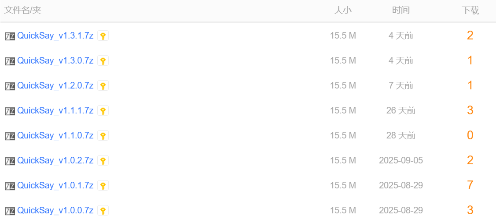
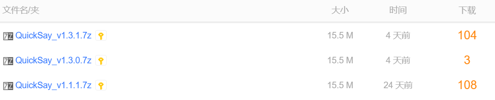
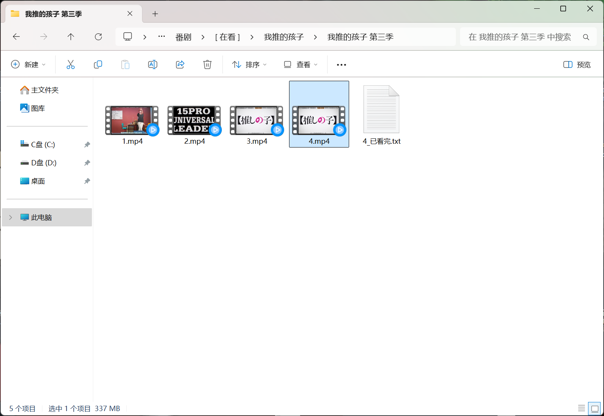
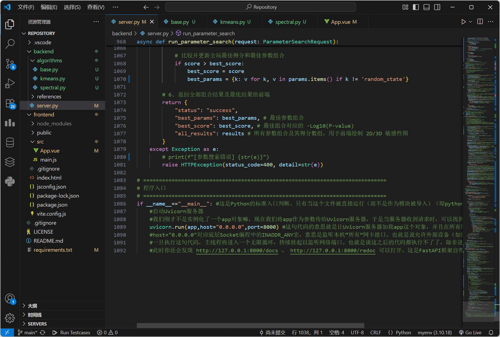
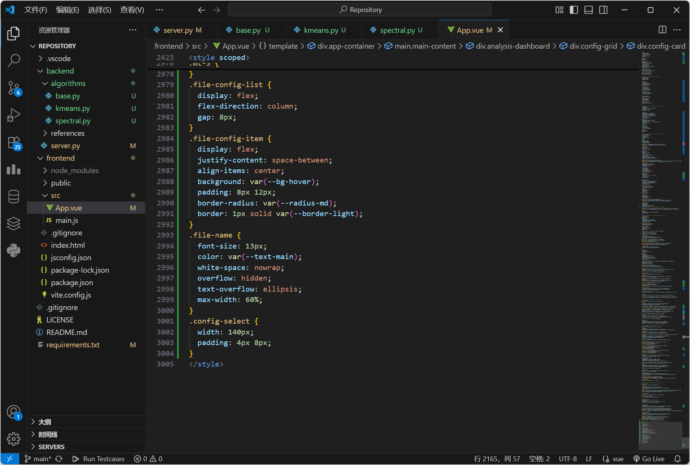
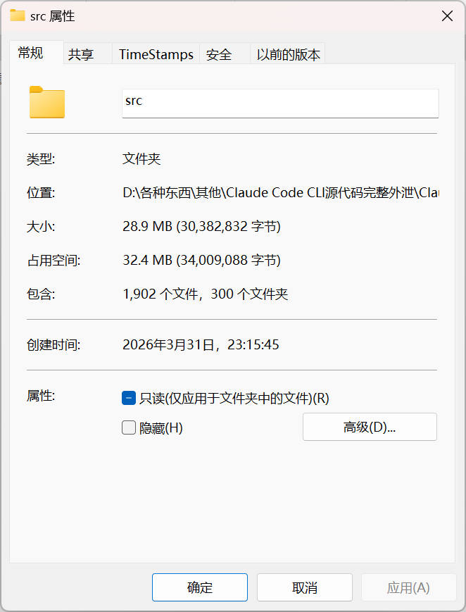

<div align="center">
  
  <h1>QuickSay</h1>
  <p>一款强大的快捷短语软件</p>
  <a href="https://github.com/DarkKandaoMaster/QuickSay/releases/latest"></a>
  <a href="https://github.com/DarkKandaoMaster/QuickSay/stargazers"></a>
  <a href="https://github.com/DarkKandaoMaster/QuickSay/releases"></a><br>
  <a href="https://github.com/DarkKandaoMaster"></a>
</div>

---

### 欢迎来测~ヾ(≧▽≦*)o
###### 该软件目前只支持Windows 10/11，不打算支持macOS/Linux/Windows 7


## QuickSay是干什么的？
如果您经常把常用短语（命令行、<strong title="输入Prompt真的很好用">AI提示词</strong>、固定的话术）保存在一个文本文件里，并在需要时打开这个文件复制粘贴。  
那么您就可以试用一下QuickSay。把常用短语保存在QuickSay里，并在需要时使用QuickSay输入。  

QuickSay的优势：  
- UI好看。简洁、现代、美观、高效。  
- 功能全面，比如支持按下角标对应按键输入、自定义短语快捷键输入、连续输入、搜索框搜索、备注等功能。  
- 甚至支持在短语中插入标签，让QuickSay除了输入文字，还能按键、停顿、粘贴图片/文件。  
- 免费、开源、无广、无需联网，未来我也不打算加上这些内容。  
- 开发者持续维护，愿意为它付出时间。  
- 因为是用Qt开发的，所以体积小（15MB）、运行快。  
- 适合Qt新手自学。代码注释超级详细，代码内容也比较简单，完全不用像学算法那样理解半天都理解不了这段代码是干什么的。如果把这代码给曾经的我看，估计用不了一周我就能自学成才，并且发布QuickSay_v1.0.0了。  

这里放一张软件窗口的全家福↓  
<br>


## 如何下载和安装
#### 方法一：
看到右边的Releases（发行版）了吗？点它，于是进入项目发布页，再点击链接QuickSay_v1.7.0.7z，于是开始下载。  
下载完成后，将得到的文件解压，得到：  
```
QuickSay文件夹
1_如何安装或更新QuickSay.txt
2_QuickSay使用操作.txt
```
直接把 **QuickSay文件夹** 放在随便什么文件夹里，然后双击QuickSay.exe。  
路径有中文空格都行，但是不要放在Program Files之类的需要管理员权限的文件夹里。  
#### 方法二：
点进这个蓝奏云链接：https://wwlt.lanzoum.com/b014wmlo5g 密码:star  
然后点击链接QuickSay_v1.7.0.7z，再点下载按钮，于是开始下载。  
接下来的步骤同上。  


## 如何更新
直接用 QuickSay文件夹 **替换**掉 电脑里原有的QuickSay文件夹 。  


## 基本使用
快捷键：按下快捷键（默认Ctrl+Shift+V）呼出QuickSay  
添加短语：右上角加号  
修改/删除：右键短语  
排序：拖动短语  

点击短语：输入对应短语  
上下方向键↑↓：移动光标  
回车键Enter：输入光标处短语  

右键左上角分组：新建/修改/删除分组  
分组排序：拖动分组  
左右方向键←→：切换分组  
鼠标滚轮：也可以切换分组  


## 常见使用问题
- 不要直接在解压软件里运行QuickSay.exe  
- 修改短语或设置后，退出重进QuickSay，发现短语根本没被修改，那必然是因为您把QuickSay安装在Program Files之类的需要管理员权限的文件夹里  
× 解决方法：把QuickSay安装在其他文件夹  


## 许可证
本项目采用 MIT 许可证。详情见 `LICENSE` 文件。也就是说您可以自由使用我的软件和代码，甚至商用。只要保留许可证和版权声明就行  


## 如何复现？如何运行代码？
1. 首先下载代码  
2. 然后您需要去下载个QT。教程推荐这篇文章：https://blog.csdn.net/qq_62888264/article/details/132645054  
3. 打开Qt Creator，按教程说的新建一个项目，名称写“QuickSay”，然后无脑下一步就行了  
4. 在文件资源管理器里找到这个新建的项目，把第1步下载下来的 QuickSay文件夹里的东西 直接**移动**到这个项目文件夹里，选“替换目标中的文件”  
5. 回到Qt Creator，点击左侧的“项目”，关闭“Shadow build：”这个选项  
6. 于是就可以运行了！**与我一同，成为开发者吧！**  
##### 说几个容易踩的坑：
- 如果运行出来一个窗口，但是窗口右上角没有齿轮图标之类的，那就是第4步没有把icons文件夹移动进去  
- 如果运行时报了一堆错，那大概率就是第5步没有关闭“Shadow build：”这个选项  


## 目前想到的之后版本要更新的内容
- 很多内容。因为想更新的内容太多了所以就暂时不写在这了  


## 目前不打算更新的内容
- 账号登录、同步  


# 感谢使用QuickSay！如果觉得好用记得点个Star！砍刀会感谢您的！
<br>

# 如有反馈或建议，欢迎直接在GitHub Issues中提交。因为这样我会收到邮件通知，肯定会及时回复。  

## 我的亿些碎碎念
某天，厌倦了学习的砍刀突然想到：诶要是我也有一个项目，那该多好。  
于是QuickSay这个项目就启动了。  
于是......  

你使用软件时的每一分舒适，都是开发者绞尽脑汁争取来的。 ——强壮的砍刀  
最小能用版本只需要277行，提升用户体验需要1825行...  

我的天，终于搞完了...  
感谢Qt，感谢C++，感谢CSDN，感谢vscode，感谢记事本，感谢电脑，感谢砍刀，感谢暑假，感谢水杯，感谢泡面......  
感谢ta们的大力支持。  
但是不感谢Qt Creator。nnd代码写到七八百行时改几个字符都会卡半天。  

萌新开发的第一款软件，还请大家多多关照啦~~  

| 阶段 | 日期 |
| ---- | ---- |
| 产生想法、需求分析、可行性分析 | 8.10~8.14 |
| 纠结开发软件选Qt还是Electron | 8.14~8.15 |
| 边自学Qt边开发软件，做出最小能用版本 | 8.15~8.20 |
| 做出发布版本 | 8.20~8.27 |
| 写README文件 | 8.28 |
| 写那两个txt文件 | 8.29 |

░░░░░░░░░░░▄▄  
░░░░░░░░░░░█░█  
░░░░░░░░░░░█░█  
░░░░░░░░░░█░░█  
░░░░░░░░░█░░░█  
███████▄▄█░░░██████▄  
▓▓▓▓▓▓█░░░░░░░░░░░░█  
▓▓▓▓▓▓█░░░░░░░░░░░░█  
▓▓▓▓▓▓█░░░░░░░░░░░░█  
▓▓▓▓▓▓█░░░░░░░░░░░░█  
▓▓▓▓▓▓█░░░░░░░░░░░░█  
▓▓▓▓▓▓█████░░░░░░░░█  
██████▀░░░▀▀██████▀  

什么什么？2025.8.29居然是七夕节(⊙Д⊙)  
在七夕节发布v1.0.0，感觉还挺浪漫的~  

这里记录一个我改bug的经历：  
v1.0.0发布当天，我发现了个bug：在微信输入框使用QuickSay居然输入不了。于是我立刻进行研究。  
结果我发现居然连PowerToys的高级粘贴都做不到在微信输入框输入...那我一个萌新又怎么做得到？  
于是此时我已经打算放弃了，新README文件都已经写好了。  
但毕竟很多人的聊天区域都在微信，要是我就这么把软件发出去，感觉没法给用户一个交代。于是我继续研究。  
最终我想到了延迟输入。  
于是我在输出函数里加了个singleShot，延迟50毫秒再输出，结果QuickSay成功在微信输入框输入了！  

---

2025.9.4  

我回来啦。  
呼，这几天我看完了《魔女的夜宴》宁宁线。bad end、happy end、后日谈都看了。  
 <br>
我已经百刀不侵啦！（）  
唉果然还是有点遗憾呀...  
真的是一个很好很浪漫的故事呢。我很感谢这个故事。  
话说我第一次推魔宴甚至还推到共通线end。单身结局，不愧是我。  

其实本来启动QuickSay这个项目之前我就想看魔宴了，但因为那时我正处于看完另一个galgame的回味状态，满脑子都是那个galgame，所以就打算搞完这个项目后再来看魔宴。  
于是README里就有了这篇内容。  
玩的时候我想了很多，也写下了很多感想。要是把它们都放上来恐怕10篇README都不够我写。  
emmm希望大家都不要像我一样容易想太多。容易想太多可不是好事呀...  

那么接下来...  
打算更新一下QuickSay，然后就开始学习，直到暑假结束。  
喂，前面可是地狱呀...  
话说不知道大家什么时候开学，反正我们是9月13日开学。  

---

2025.9.6  

结果软件发布这么多天我一个建议都没收到...  
好吧，那么因为我自己使用这个软件还挺舒服的，所以以后我可能很少会来更新软件了，但估计还会来README发一下癫。  
现在看来，这几天我可能有点自大了，了解了下才发现开发QuickSay其实没什么了不起的。  
QuickSay项目落地那几天我很有成就感，四处找人宣传、炫耀，甚至还考虑过向几年都没联系过的同学和老师宣传一下，但因为我比较害羞，所以没向那部分人宣传。  
唉这就是青春呀。（真的假的...）  
<br>

---

2025.9.9  

我又回来啦。  
emmm...事情是这样的，本来我的打算是“更新一下QuickSay，然后就开始学习”。  
结果更新是更新了，但这几天不管我怎么学都学不进去...  
于是我就打算在暑假结束之前偷点懒了。  
反正接下来时间还很充裕所以应该没关系？  
好！就这么决定了！（总之砍刀说服了自己）  
这是，越临近开学越不想学习吗...像去年暑假一样。  

---

2025.9.13  

怎么就开学了...  

---

2025.9.18  

9.15那天，我收到了第一个issue。  
那时给我激动的...看来这款软件还是有用户的嘛。  
最后我当然也完美地实现了这个issue。  
无论何时何地，砍刀都在这里，回应着你的期待♪  

累死啦...  
这个月都不想碰Qt了...  

啊啊想念我的暑假了...这几天经常更新到一半就要去上课了。暑假你不要走了好不好...  

---

2025.9.20  

OK！于是QuickSay就一鼓作气地更到了v1.1.1。现在功能可以说已经比较完善了。  
没想到今天还是CSP初赛。大家加油呀！  
讲真，其实我挺不能想象的，初中时我看个C++教材，班主任都说要没收我这本书。  
所以小学中学的我仅仅只是一个听老师话的、把学习时间全花功课上的乖孩子，根本没听说过算法是什么。  
<br>

---

2025.9.23  

给大家介绍一下，芝士窝的干将莫邪↓  
---[=======>  
o▬▬◙▆▅▆▆▇▇◤  

---

2025.9.26  

没想到QuickSay先在吾爱论坛火了↓  
<br>
好多人呀，软件发布这么多天我Github发行版的总下载量甚至都没有这个数字的一半...  
可惜吾爱论坛不允许留下联系方式，不然我肯定把他们都拉过来点Star。  

---

2025.10.12  

v1.3.0已更！  
累死我了...更了好多内容...  
代码量：1161行→1527行  
不是说功能已经比较完善了吗...怎么还有这么多内容要写...  

现在一想到我实现了分组栏这个功能我就“嘿嘿嘿”地想笑。  
没想到我居然真的能做到。  
真的是超级大更新，更新前后简直是C语言和C++的区别。  
现在的QuickSay已经可以和搜狗输入法手机版的快捷短语平起平坐了。  
之前不是说我因为比较害羞所以没向几年都没联系过的同学和老师宣传QuickSay嘛，现在敢了。  

有时候真觉得像QuickSay这种代码量几千行以上，却还是能正常实现所有功能的项目是一件艺术品，一个奇迹。  
我们程序员真就是创造奇迹的人。  

---

2025.10.15  

体测体测体测！  
今天我们体测，测除了一千米之外的项目。  
这场战斗，我们必须胜利。  

(ó﹏ò｡)  
大败而归...  
不要哇...  
目前我体测总分是58.4，也就是说下次测一千米，我必须跑进3:34，体测总分才能超过75，才能评奖学金。  
让我下次一千米体测跑进3:34好不好...  
唉这个一千米，真的能靠练习和努力提升吗...  

喔喔今天我才知道，昨天微软终止对Win10的支持了↓  
<br>
这一天还蛮有纪念意义的（）  
见证历史。  
哈哈不过我一直用的是Win11，目前对Win11的使用体验非常满意，​以后也打算当个Win11钉子户。  
讲真，虽然网上都在骂Win11，但我觉得把Win11调教一两天之后还是很好用的。  
目前想到的几个重点调教：  
1.右键菜单永久展开（这个不用说了，估计大部分人骂Win11都是因为这个）  
2.关闭任务栏预览窗口上浮动画（不然有时候点击任务栏窗口，窗口不会显示，非常影响使用体验）  

以后有空的话我或许会把Win11的实用调教整理出来发一个帖子？  

---

2025.10.17  

嗯嗯？  
这是我发在Github的蓝奏云链接的下载量↓  
<br>
这是我发在吾爱论坛的蓝奏云链接的下载量↓  
<br>
(⊙Д⊙)  

---

2025.11.18  

时过境迁物是人非呀。  
现在回顾一个月前的自己感觉像是隔了一个世纪。  
这一个月我学了好多，了解了好多，前进了好多。  
10.12不是说我敢向几年都没联系过的同学和老师宣传QuickSay嘛，现在又不敢了（）  
幸好没宣传，这种小项目就算有很多Star也不能说明什么。  

唉，知道得越多，越觉得自己无知；  
学得越多，越觉得钱难赚。  
如果说像QuickSay这种代码量几千行却还是能正常实现所有功能的项目是一个奇迹，那么能独立开发出企业级项目的人就无异于造物主了。  
因此我必须登神。  
但登神谈何容易，我越学越觉得要学的东西非常之多，一眼望不到头，哪怕大学四年我不间断地学习，估计最后也仅仅只能入个门。  
我担心：就算一直学到大学毕业，也做不到一进入企业就创造利益，就业难；就算一直学到三十五岁，对计算机的了解也仅仅只是皮毛，没有能证明自己的项目，被裁员后再就业难。  
祝我能找到解法。  

喔对了，今年体测总分我是75.5分。嘿嘿这样就好。  

---

2025.12.14  

我更新了整整一周的QuickSay...  
代码量：1527行→1825行  
最近好忙...一堆东西要学...要不是被群友催更新我是根本不可能来更新的。  
结果一更新，我就上头了，敲了整整一周代码，更新了这么多内容...  
累死啦...  
但是我现在还不能休息，因为还有一堆东西要学...  

---

2025.12.27  

昨天我发布了这个仓库 https://github.com/DarkKandaoMaster/Subtype-DCC_Engineering ，也顺带练习使用了一下Git。  
原来Git这么方便！  

---

2025.12.29  

再见了，2025年所有的周末。  
接下来我就要告别代码，复习期末考了。  
啊啊为什么还有期末考...让我们专心搞技术不行吗...  

哇哇好耶！感谢支持！  
<br>

---

2026.1.14  

今天原神更新6.3，月之四版本。  
所以今天我第一时间登进原神，完成主线，与荧新衣服相遇。  
久等了，我来接你了。  

天哪她真的好美...  
听说过这样一个说法：  
“  
对于想要见到的人，人们总是在见面前，不断想象那时的情景，想象自己在见面时说出的话，能让对方露出笑容。  
慢慢地，所有想说的话，还没有相见之前，就已经说完了。  
而在真正重逢的那一刻，你会发现，对方比你的一切想象还要美好——可一时之间，你又想不出怎么夸奖对方了。  
”  
这个说法很适合形容现在的我，心动、想说些什么却又找不到合适的词语，只能反复地说“美”这个字。  
我真的无从表达自己的喜爱...  
真的好美...  
我想亲屏幕一口...我有亲屏幕一口的冲动...就像最开始我和荧相遇时那样。  
真的很符合我心目中的那个形象...  
好想把荧身体上的每个地方都摸一遍呀...  
好想紧紧抱住荧呀...  

新衣服满足了我的一切想象。  
不过如果真要说的话，我感觉自己还是比较喜欢原衣服。  
一是因为我比较喜欢白的，喜欢原衣服那一抹白色；二是因为原衣服的荧看起来更加呆呆的。  
但在这之前还请让我对着新衣服发亿会儿癫啊啊啊啊啊...  
 <br>

所以我决定先带着这套衣服四处走走。  
嗯嗯？新衣服不穿灯笼裤了？现在穿的是...内裤？是内裤吗？看这个薄度应该是内裤？这内裤有点单调呀，单调得像星铁主角内裤。  
等等，荧的过膝靴怎么往上调了？更过膝了...而且这个过膝靴也显得小腿有点细。  
还有北半球也没了...  
背后的丝带也变宽了...原衣服荧跑步时我还挺喜欢看它俩飘来飘去的，但新衣服丝带变宽了我就不喜欢了。  
头发也更加细致了。不过我更喜欢的还是原衣服那个头发...  
还有半透明刘海。虽然我是不怎么喜欢半透明刘海啦。  
甚至肚脐都有了...  

讲真，其实我不怎么喜欢过多的装饰...而原衣服对我来说就刚刚好。  
综上，原衣服更胜一筹！  
以后我估计还是用荧原衣服跑图比较多。  

感觉新衣服有股人妻感？尤其是新衣服头像。  
看来荧是我老婆这件事藏不住了（）  


说回原神6.3主线，6.3主线也太好了...整个挪德卡莱主线也太好了...  
真的很用心呢，各个方面上。  
今天我过完了原神6.3主线。  
好开心好满足...  

---

2026.2.2  

最近很多用户都来找我反馈建议了（用户建议都堆成山了），好欣慰呀。  
不过最近我正在开发老师交给我的一个项目。等我把这个项目开发完哈！时间的话至少需要半个月吧...半个月后我再来更新QuickSay！  
就是这个项目：https://github.com/DarkKandaoMaster/InferenceDeck  
话说为什么我一忙起来就会有一堆人来反馈建议...  

---

2026.2.6  

仍然简直是神迹...  
全程张着嘴巴看完的...  
我觉得这太厉害了...  
<br>
啊啊好想看第5集...这么断章是什么意思呀...  

---

2026.2.23  

呃呃...  
半个月过去了，我的InferenceDeck项目确实大部分都开发完了。  
但是2月25日~3月2日我和爸妈要去海南旅游（）  
那就之后再说吧！  

---

2026.3.3  

我来更新QuickSay啦！  

---

2026.3.4  

遍插茱萸少三人。  
<br>
↓  
<br>
真成DFS了：  
原神（入坑）→星铁（入坑）→崩三（入坑）→绝区零（入坑）→  
绝区零（退坑）→崩三（退坑）→星铁（退坑）  

---

2026.3.6  

光速更了1.5.0版本！  
本来还有一些内容想更新的，但是要做的事还有好多好多，所以只能更到这里了...  
woc怎么还有bug？！  
于是我又光速更了1.5.1版本。  
结束了。  
好耶那接下来我继续去开发InferenceDeck项目啦~  

---

2026.3.23  

没想到InferenceDeck项目的底层设计出问题了，于是这几天我把各处代码都翻新了一遍（尤其后端）。  
总算搞定了...↓  

<br>
我来解释一下这两张图片哈，用过vscode+Git的人应该都知道，在编辑代码后，提交更改前，绿色块代表新增，蓝色块代表修改，红色块代表删除。  
可以发现这两张图片的滚动栏区域全都是蓝蓝绿绿的。  
也就是说后端我改动了差不多百分之七十的代码，前端我改动了差不多百分之四十的代码。  
......  
再也不想改这么多代码了...  

---

2026.3.25  

完结撒花完结撒花。  
<br>
第三季结局很好呢。  
是个很好的结局呢。  
跟86一样，倒数第二集还什么什么的，最后一集就结局这么好了。  
感觉内心的洞都被填上了。  

---

2026.3.31  

Claude Code CLI源代码完整外泄？？？  
我看到了神迹！！！  
<br>

我感觉厉害的人实在是太多了，我跟他们之间的差距实在是太大了。  
我感觉他们真的好厉害...感觉他们什么都会...  
我感觉我穷尽一生都无法达到他们的境界，而我也不可能穷尽一生。  

---

2026.4.8  

最近不是清明节放了个假嘛。  
于是我看完了《eden*》。  
 <br>
简直是神迹...  
很温柔的一个故事呢。  
制作组你就不能写一段把所有人都复活然后聚在一块的剧情吗？？  

---

2026.4.9  

天呐...这是？？？神迹！！  
今天我想找《eden*》的bgm，于是就想到了去Steam上找找。因为你看星白、UT都有Soundtrack。  
结果真被我找到了《eden* Soundtrack》。  
然后我就被它的封面震撼到了↓  
<br>

---

2026.4.12  

我对登神的定义变了。  
未来前所未有的清晰。小打小闹的日子已然结束。  
接下来，就是我的登神之路了。  

当终焉的陨石落下，唯有成神的砍刀才能跳脱既定的灭亡。  

---

2026.4.23  

五一放假那会儿我再来更新QuickSay！  

---

2026.5.1  

我来更新QuickSay啦！  
写了几个月的Python代码再来看C++代码感觉好不习惯...  
C++、Qt开发软件真的煎熬...啥东西都要自己实现...  
有种想用其他语言其他框架把QuickSay重写一遍的冲动...  
能用C++、Qt把QuickSay的UI写得这么好看，我已经尽力了...  

---

2026.5.7  

结束了。。  
我的QuickSay更新，应该就又告一段落了。。  
接下来就要去忙别的项目了。。  
OmicsInferenceDeck，我回来啦。。  

啊...  
跟你们说哦，最近我  
先是参加了mathorcup数学建模比赛；  
然后参加了统计建模比赛；  
还有网挑资格赛；  
还更新了QuickSay、OmicsInferenceDeck项目。  

今天更新完QuickSay的时候我本来以为这周末能休息的，结果又来活了...  
老师叫我去搞大创项目，还把学长的一篇未发表的论文给我了。  
那这次我必须全力以赴，我不能辜负期待，糟蹋了这篇论文。  
感觉整个五月份我好像都不能休息了...5月15号之前要把大创项目的论文搞出来，六月初之前要把OmicsInferenceDeck（网挑选拔赛）彻底完成。  

在一位创业者的文章里看到过一种说法“被钱推着走”。  
我现在大概是被项目推着走吧。  
我已经停不下来了。  

---

2026.5.16  

我必须做点什么。在终焉降临之前。  

我必须成为神明，超越终焉。  

---

2026.5.18  

普通人成为神明的唯一途径，居然是神明的帮助吗。  

既然给了我这个机会了，那么哪怕四十岁我就要过劳死，我也要片刻登神！  

---

2026.5.25  

我失败了。  
我拿出自己最好的状态与神明对峙，但最终我的幼稚暴露无遗。  
我再次跌到了谷底。  
如果把已经自以为摸到了神的门槛但最终跌落谷底过的我钉死在墙上，或许就能组成一条可以让我稍微接近点神明的道路吧。  

---

2026.6.5  

我必须要拥有能与一个世界匹敌的力量。  