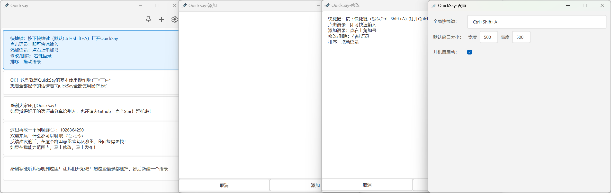

  
  <h1>QuickSay</h1>
  
一款强大的快捷短语软件

  
  
   
  

---

### 欢迎来测~ヾ(≧▽≦*)o

## QuickSay 是干什么的？
如果您经常把常用短语（<strong title="输入 prompt 很好用">AI 提示词</strong>、命令行、固定的话术）保存在一个文本文件里，并在需要时打开这个文件复制粘贴。  
那么您就可以试用一下 QuickSay。把常用短语保存在 QuickSay 里，并在需要时使用 QuickSay 输入。  

软件窗口截图↓  
 

###### 该软件目前只支持 Windows 10/11，不打算支持 macOS/Linux/Windows 7

## 如何下载
#### 方法一：
点进右边的 Releases（发行版）下载。  
#### 方法二：
点进这个蓝奏云链接下载：https://wwlt.lanzoum.com/b014wmlo5g 密码:star  

## 如何更新
直接用 新QuickSay.exe **替换**掉 旧QuickSay.exe。  

如果您是 v1.x.x 用户，可以在保留 config.json、data.json、tab.json 的基础上，把 QuickSay 文件夹里的其它文件都删掉，然后放入 新QuickSay.exe。  

## 许可证
本项目采用 MIT 许可证。  

## 感谢使用 QuickSay！如果觉得好用记得点个 Star！砍刀会感谢您的！
如有反馈或建议，欢迎在 GitHub Issues 中提交。因为这样我会收到邮件通知，肯定能及时回复。  
 

## 一些碎碎念
其实 QuickSay 最开始是在吾爱论坛火起来的。感谢吾爱论坛能带给 QuickSay 这么多用户！  
https://www.52pojie.cn/thread-2129139-1-1.html  
https://www.52pojie.cn/thread-2061920-1-1.html  
