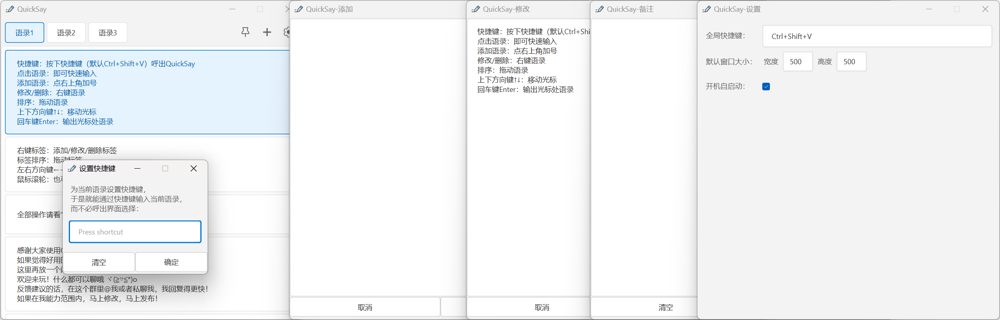

# QuickSay ---好用的电脑快捷语录软件
### 欢迎大家来测喵~
###### 该软件只支持Windows。所以Windows自助，Linux/macOS自强~


## 如何下载和安装
（因为考虑到很多GitHub新手不会下载软件，所以就把这部分放在最上面了。~~毕竟曾经我也是新手之一呀~~）  
#### 方法一：
看到右边的发行版（Releases）了吗？点它→，于是进入项目发布页，再点击QuickSay_v1.0.2.7z，于是开始下载  
下载完成后，将得到的文件解压，于是得到  
```
QuickSay文件夹
1·如何安装或更新QuickSay.txt
2·QuickSay全部使用操作.txt
```
直接把 **QuickSay文件夹** 放到随便什么路径下（有中文空格都行）（但是不要放到Program Files之类的文件夹里面。这种文件夹好麻烦的改个json文件都需要管理员权限），然后双击打开里面的exe文件就可以正常运行软件了。  
那两个txt文件懒得看的话可以直接删除，没关系的（虽然还是建议看一下...）  
#### 方法二：
直接点进这个蓝奏云链接：https://wwlt.lanzoum.com/b014wmlo5g 密码:star  
然后点击QuickSay_v1.0.2.7z，再点下载按钮，于是开始下载  
接下来的步骤同上  


## 如何更新
直接把 QuickSay文件夹 **替换**掉 电脑里原有的QuickSay文件夹 就行了。  


## 软件功能
您可以在QuickSay里添加语录，并在需要用到时按下快捷键打开QuickSay，点击语录，于是快速输入( •̀ ω •́ )✧  

那么可以存放什么语录呢？  
颜文字、骂人的话（快捷喷人）、频繁要用到的AI绘画tag等。目前我就存的这些。  

QuickSay不需要联网，所有数据均保存在本地。  
因为是自己开发的，所以免费、开源、无广、无需登录，未来也不打算加上这些内容。所以放心使用吧！  

这里放一张软件窗口的全家福↓  
<br>


## 基本使用
快捷键：按下快捷键（默认Ctrl+Shift+V）打开QuickSay  
点击语录：即可快速输入  
添加语录：点右上角加号  
修改/删除：右键语录  
排序：拖动语录  

OK！这些就是QuickSay的基本使用操作啦 (￣▽￣)~*  
想看全部操作的话请看“2·QuickSay全部使用操作.txt”  


## 常见使用问题
- 这是用来快捷输入的软件呀（笑哭），别没有把鼠标光标放到可以输入文字的地方就打开、点击语录，于是输入失败，于是就来找我反馈了  
- 把焦点放到可以输入文字的地方后，点击任务栏的QuickSay图标让它置顶，此时你的焦点就不在那个可以输入文字的地方了，也就是说此时你点击语录会输入失败。唔这个问题我在之后的版本试着解决一下  
- 不要直接在解压软件里运行QuickSay.exe呀...也就是说不要先运行QuickSay.exe，然后把整个文件夹复制到其他地方，再双击运行QuickSay.exe，于是你电脑里就运行了两个QuickSay  
  × 解决方法：确保你电脑里只有一个QuickSay.exe。然后方法一是右键托盘图标把两个QuickSay都退出，再打开唯一的那个QuickSay.exe；方法二是重启。重启能完全解决这个问题。遇事不决重启解决  
- 显示有个bug，比如输入“ᐠ( ᑒ )ᐟ”，那么显示会出问题。但是输出的话还是能正常输出的。等我了解一下这个bug的原因哈，如果在我能力范围内，那么这也是要修复的  
- 如果你在添加/修改/删除语录，或者改变语录顺序后，退出并重新打开QuickSay，发现语录根本没被修改，那这必然是因为你把QuickSay安装在Program Files之类的文件夹里面  
  × 解决方法：把QuickSay安装在其他文件夹里  


## 许可证
本项目采用 MIT 许可证。详情见 `LICENSE` 文件。也就是说您可以自由使用我的软件和代码，甚至商用。只要保留许可证和版权声明就行  


## 如何下载代码并使用
1. 下载代码应该不用我多说。毕竟按钮在最上面最明显的地方。没错就是那个绿色按钮  
2. 然后你需要去下载个QT。教程推荐这篇文章：https://blog.csdn.net/qq_62888264/article/details/132645054  
3. 打开Qt Creator，按教程说的新建一个项目，名称写“QuickSay”，然后无脑下一步就行了 （~~虽然名称可以随便写，但解释起来好麻烦所以还是算了吧~~）  
4. 在文件资源管理器（就是此电脑）里找到这个新建的项目，把 第1步下载下来的全部文件和文件夹 都直接移动到这个项目文件夹里，选“替换目标中的文件” （~~应该不会有人直接把压缩包移动到项目文件夹里吧...~~）  
5. 回到Qt Creator，点击左侧的“项目”，关闭“Shadow build：”这个选项  
6. 于是就可以运行了！点击左侧的那个绿色三角形，你会发现弹出了个和QuickSay发行版一模一样的窗口。那么恭喜你！此时你就可以正常运行代码了。**与我一同，成为开发者吧！**  
##### 说几个容易踩的坑：
- 如果运行出来一个窗口，但是窗口右上角没有齿轮图标之类的，那就是第4步没有把icons文件夹移动进去  
- 如果运行时报了一堆错，那大概率就是第5步没有关闭“Shadow build：”这个选项  
#### 这里再放一个悬赏委托◥▇▇▆▆▆▅▆◙▬▬o
**「 做完上面说的7个步骤，然后告诉作者能否正常运行代码。 」**  
###### 赏金：0.1元，以及作者大大的感谢！


## 目前想到的之后版本要更新的内容
- 可以同时打开多个添加窗口和多个修改窗口  


## 不打算更新的内容
- 暂无  


# 感谢大家使用QuickSay，也感谢大家能听我唠叨到这里！如果觉得好用的话还请点个Star！拜托了！


## 我的亿些碎碎念
某天，厌倦了学习的砍刀突然想到：诶要是我也有一个项目，那该多好。  
于是QuickSay这个项目就启动了。  
于是......  

你使用软件时的每一分舒适，都是开发者绞尽脑汁争取来的。 ——强壮的砍刀  
最小能用版本只需要277行，提升用户体验需要856行（笑哭）...  

我的天，终于搞完了...  
感谢Qt，感谢C++，感谢CSDN，感谢vscode，感谢记事本，感谢电脑，感谢砍刀，感谢暑假，感谢水杯，感谢泡面......  
感谢ta们的大力支持。  
但是不感谢Qt Creator。nnd代码写到七八百行的时候改个注释都会卡得半死。  

萌新开发的第一款软件，还请大家多多关照啦~~  

| 阶段 | 日期 |
| ---- | ---- |
| 产生想法、需求分析、可行性分析 | 8.10~8.14 |
| 纠结开发软件选Qt还是Electron | 8.14~8.15 |
| 边自学Qt边开发软件，做出最小能用版本 | 8.15~8.20 |
| 做出发布版本 | 8.20~8.27 |
| 写README文件 | 8.28 |
| 写那两个txt文件 | 8.29 |

emmm要是早知道需要的时间成本这么多，我可能就不会启动这个项目了。(╯°□°)╯︵ ┻━┻  

对了，因为注释写得超级详细，而且代码内容也比较简单，所以我认为这个软件还是挺适合初学者自学的，完全不用像学算法那样理解半天都理解不了这段代码是干什么的。  
真的太详细了，几乎每句代码都有注释。如果把这些注释给8.15的我看的话，估计用不了一周我就能自学成才，并且发布软件了。  

还有就是因为这个项目比较简单，并且我检查了很多遍，所以应该大概可能没有bug，也没有内存泄漏？  

OK！那就到这里了！再次感谢大家能听我唠叨到这里！大家开学快乐（bushi）！  

这里再放一个闲聊群💬：1026364290  
欢迎来玩！什么都可以聊哦 ヾ(≧▽≦*)o  
反馈建议的话，在这个群里@我或者私聊我，我回复得更快！  
如果在我能力范围内，马上修改，马上发布！  

░░░░░░░░░░░▄▄  
░░░░░░░░░░░█░█  
░░░░░░░░░░░█░█  
░░░░░░░░░░█░░█  
░░░░░░░░░█░░░█  
███████▄▄█░░░██████▄  
▓▓▓▓▓▓█░░░░░░░░░░░░█  
▓▓▓▓▓▓█░░░░░░░░░░░░█  
▓▓▓▓▓▓█░░░░░░░░░░░░█  
▓▓▓▓▓▓█░░░░░░░░░░░░█  
▓▓▓▓▓▓█░░░░░░░░░░░░█  
▓▓▓▓▓▓█████░░░░░░░░█  
██████▀░░░▀▀██████▀  

什么什么？2025.8.29居然是七夕节(⊙Д⊙)  
在七夕节发布v1.0.0，感觉还挺浪漫的~  

这里记录一个我改bug的经历：  
v1.0.0发布当天，我发现了个bug：在微信电脑版的输入框里使用QuickSay居然输入不进去。于是我立刻进行研究。  
结果研究了好久，我几乎完全绝望了：居然连PowerToys的高级粘贴都做不到在微信电脑版输入框里粘贴...那我一个萌新又怎么做得到？  
于是此时我的新README文件已经写好了：“了解了一下，这个bug我好像是真的无能为力...毕竟连PowerToys的高级粘贴都做不到在微信电脑版输入框里粘贴，那我这个萌新就更不用说了...”  
但毕竟很多人的聊天区域都在微信，要是我就这么把软件发出去，感觉没法给用户一个交代。于是我没有把新README文件立刻上传Github，而是继续研究。  
我很幸运，最终我想到了延时输出。  
于是我在shuchu函数里加了个singleShot，让它延时个50毫秒再输出，于是QuickSay成功在微信电脑版的输入框里输入了！  
我靠那时给我激动的...于是我啊啊啊叫了半天。  

---

2025.9.4  

我回来啦。  
呼，这几天我看完了《魔女的夜宴》宁宁线。bad end、happy end、后日谈都看了。  
 <br>
我已经百刀不侵啦！（戴墨镜）  
唉果然还是有点遗憾呀...  
再见，宁宁，再见，保科。能够见证魔宴这个故事，我真的很开心，真的很幸运。世界上能有这些好故事，我能够看到这些好故事，真的是一个奇迹。  
真的是一个很好很浪漫的故事呢。我很感谢这个故事。  
呼，现在我满脑子都是宁宁，闭上眼是宁宁，随便想一个什么东西，宁宁的身影都会出现在脑海里...  
话说我第一次推魔宴甚至还推到共通线end。单身结局，不愧是我。  

其实本来启动QuickSay这个项目之前我就想看魔宴了，但因为那时我正处于看完另一个故事的回味状态，满脑子都是那个故事，所以就打算搞完这个项目后再来看魔宴。  
于是README里就有了这篇内容。  
玩的时候我想了很多，也像碎碎念一样有感而发，写下了很多感想。要是把它们都放上来恐怕10篇README都不够我写。  
emmm希望大家都不要和我一样容易想太多。容易想太多可不是好事呀...  

呼，既然过完了魔宴宁宁线，那我也就知足了，也就没理由、没时间在这个暑假开启别的故事了。我该前进了...  
打算更新一下QuickSay，然后就开始学习。  
喂，前面可是地狱呀...  
话说不知道大家什么时候开学，反正我们是9月13日开学。  

emmm感觉这个README已经成了我的博客了...不过因为来看的人这么少，所以说成树洞会更合适？  